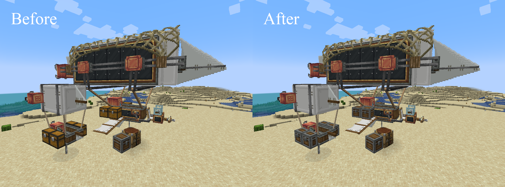
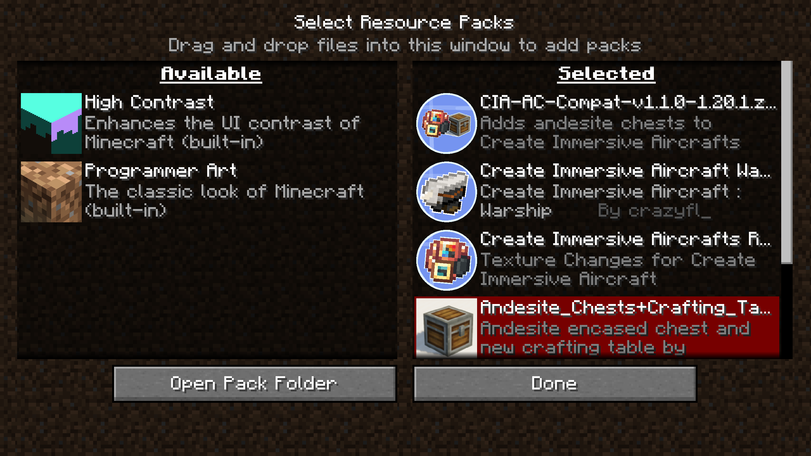

# Create Immersive Aircrafts Andesite Chests Compat

  

This tiny resource pack adds andesite chests from [Andesite Chests + Crafting Table](https://www.curseforge.com/minecraft/texture-packs/andesite-chests-crafting-table) by [mental_xpc](https://www.curseforge.com/members/mental_xpc/projects) to [Create Immersive Aircrafts](https://www.curseforge.com/minecraft/texture-packs/create-immersive-aircrafts-resource-pack) by [nicky__21](https://www.curseforge.com/members/nicky__21/projects).

## Installation

Load this resource pack after both [Andesite Chests + Crafting Table](https://www.curseforge.com/minecraft/texture-packs/andesite-chests-crafting-table) and [Create Immersive Aircrafts](https://www.curseforge.com/minecraft/texture-packs/create-immersive-aircrafts-resource-pack) as shown below.

